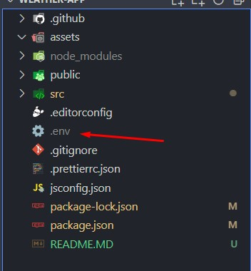

# GithubAPI

<h1>Github Repo Search App</h1>

Github Repository Search Application. Test Task.

<h2>Getting Started</h2>

These instructions will get you a copy of the project up and running on your local machine for development and testing purposes.

<h3>If you want to raise limot of requests to api, create .env file in folder with package.json </h3>

Write inside next code:

<pre>
<code>REACT_APP_API_KEY='YOUR API KEY'</code>
</pre>

As it is not a necessary step, find out it by yourself.

<h3>Installing</h3>

A step by step guide on how to get the development environment running.

Clone repository or get the copy in any other way.

<pre>
<code>npm i</code>
<code>npm start</code>
</pre>

<h2>Built With</h2>

<ul>
  <li><a href="https://reactjs.org/e">React</a> - The web framework used</li>
  <li><a href="https://redux.js.org/">Redux</a> - A Predictable State Container for JS Apps</li>
  <li><a href="https://mui.com/">MUI</a> - The library used</li>
  <li> And many other ...</li>
</ul>

<h2>Author</h2>

<ul>
  <li><strong>Frontend Developer</strong> - <a href="https://github.com/smerch88">Smerch88</a></li>
</ul>
